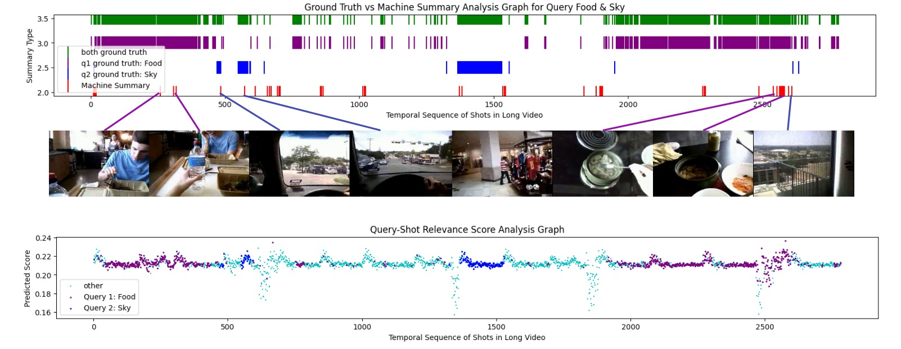

<h1>A Pytorch implementation for "Your Interest, Your Summaries: Query-Focused Long Video Summarization (FCSNA-QFVS)" [ICARCV, 2024] </h1>

> Note: This repo still requires some work and will keep updating it.

<p align="center">
<strong>Your Interest, Your Summaries: Query-Focused Long Video Summarization</strong></h1>
  <p align="center">
    <a href='https://srkds.github.io/' target='_blank'>Nirav Patel</a>&emsp;
    <a href='https://ldce.ac.in/faculty/payal.prajapati.129' target='_blank'>Payal Prajapati</a>&emsp;
    <a href='https://ldce.ac.in/faculty/maitrik.shah.246' target='_blank'>Maitrik Shah</a>&emsp;
    <br>
    L. D. College of Engineering
    <br>
    ICARCV 2024
  </p>
</p>

</p>
<p align="center">
  <a href='https://arxiv.org/pdf/2410.14087'>
    
  </a>
  </p>

## 🏡 Abstract

</img>

Generating a concise and informative video summary from a long video is important, yet subjective due to varying scene importance. Users' ability to specify scene importance through text queries enhances the relevance of such summaries. This paper introduces an approach for query-focused video summarization, aiming to align video summaries closely with user queries. To this end, we propose the Fully Convolutional Sequence Network with Attention (FCSNA-QFVS), a novel approach designed for this task. Leveraging temporal convolutional and attention mechanisms, our model effectively extracts and highlights relevant content based on user-specified queries. Experimental validation on a benchmark dataset for query-focused video summarization demonstrates the effectiveness of our approach.

## 🌈 Propose two qualitative analysis graphs

</img>

## 🙏 Acknowledgement

The evaluation code is being borrowed from <a href="https://github.com/facebookresearch/EgoVLPv2/tree/main/QFVS">EgoVLPv2</a>.

The code is inspired by <a href="https://github.com/ckczzj/CHAN">CHAN</a> and <a href="https://github.com/weirme/FCSN">FCSN</a> implementation.

## 🔗 Citation

If you find our work helpful, please cite:

```bibtex
@misc{patel2024interestsummariesqueryfocusedlong,
      title={Your Interest, Your Summaries: Query-Focused Long Video Summarization},
      author={Nirav Patel and Payal Prajapati and Maitrik Shah},
      year={2024},
      eprint={2410.14087},
      archivePrefix={arXiv},
      primaryClass={cs.CV},
      url={https://arxiv.org/abs/2410.14087},
}
```
